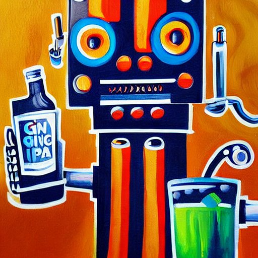

# Causality-inspired Single-source Domain Generalization for Medical Image Segmentation

Accepted for IEEE Transactions on Medical Imaging (IEEE-TMI)

[Arxiv link to a previous version](https://arxiv.org/abs/2111.12525)

**News**

We won the Fetal Tissue Annotation and Segmentation Challenge ([FeTA](https://feta.grand-challenge.org/Home/)) in MICCAI 2022, where this causality-inspired domain generalization serves as a key componnet to our solution. It significantly improves our model robustness against images from unforeseen insitutes.

**Highlights**

Your effortless tool for segmentation challenges that involve domain generalization.

- Plug-and-play: NEUTRAL to network architectures: No need to make any changes to your favorite CNNs or transformers. Just append this simple cocktail of GIN and IPA to your data augmentation pipeline.

- Easy-to-train: NO adversarial-/meta-learning involved. Just add a commonly-used consistency regularization term to your loss function.  

- 3D support: 3D version of GIN has already been added to the repository. 3D IPA will be released soon as well.

Repository under construction. Might still be buggy.



(Image generated using stable diffusion)

**Abstract**

Deep learning models usually suffer from domain shift issues, where models trained on one source domain do not generalize well to other unseen domains. In this work, we investigate the single-source domain generalization problem: training a deep network that is robust to unseen domains, under the condition that training data is only available from one source domain, which is common in medical imaging applications. We tackle this problem in the context of cross-domain medical image segmentation. Under this scenario, domain shifts are mainly caused by different acquisition processes. We propose a simple causality-inspired data augmentation approach to expose a segmentation model to synthesized domain-shifted training examples. Specifically, 1) to make the deep model robust to discrepancies in image intensities and textures, we employ a family of randomly-weighted shallow networks. They augment training images using diverse appearance transformations. 2) Further we show that spurious correlations among objects in an image are detrimental to domain robustness. These correlations might be taken by the network as domain-specific clues for making predictions, and they may break on unseen domains. We remove these spurious correlations via causal intervention. This is achieved by resampling the appearances of potentially correlated objects independently. The proposed approach is validated on three cross-domain segmentation tasks: cross-modality (CT-MRI) abdominal image segmentation, cross-sequence (bSSFP-LGE) cardiac MRI segmentation, and cross-center prostate MRI segmentation. The proposed approach yields consistent performance gains compared with competitive methods when tested on unseen domains. 


```
@article{ouyang2021causality,
  title={Causality-inspired Single-source Domain Generalization for Medical Image Segmentation},
  author={Ouyang, Cheng and Chen, Chen and Li, Surui and Li, Zeju and Qin, Chen and Bai, Wenjia and Rueckert, Daniel},
  journal={arXiv preprint arXiv:2111.12525},
  year={2021}
}

```


### 1. Dependencies

Please install essential dependencies.

```
dcm2nii
jupyter==1.0.0
nibabel==2.5.1
notebook==6.0.2
numpy==1.15.1
opencv-python==4.1.1.26
Pillow==5.3.0
sacred==0.7.5
scikit-image==0.17.2
scipy==1.1.0
segmentation-models-pytorch==0.1.3
SimpleITK==1.2.3
tensorboardX==1.4
torch==1.3.0
torchvision==0.4.1
tqdm==4.32.2
```

### 2. Data pre-processing 

**Abdominal MRI**

0. Download [Combined Healthy Abdominal Organ Segmentation dataset](https://chaos.grand-challenge.org/) and put the `/MR` folder under `./data/CHAOST2/` directory

1. Converting downloaded data (T2 SPIR) to `nii` files in 3D for the ease of reading.

run `./data/abdominal/CHAOST2/s1_dcm_img_to_nii.sh` to convert dicom images to nifti files.

run `./data/abdominal/CHAOST2/png_gth_to_nii.ipynp` to convert ground truth with `png` format to nifti.

2. Pre-processing downloaded images

run `./data/abdominal/CHAOST2/s2_image_normalize.ipynb`

run `./data/abdominal/CHAOST2/s3_resize_roi_reindex.ipynb`

The processed dataset is stored in `./data/abdominal/CHAOST2/processed/`

**Abdominal CT**

0. Download [Synapse Multi-atlas Abdominal Segmentation dataset](https://www.synapse.org/#!Synapse:syn3193805/wiki/217789) and put the `/img` and `/label` folders under `./data/SABSCT/CT/` directory

1.Pre-processing downloaded images

run `./data/abdominal/SABS/s1_intensity_normalization.ipynb` to apply abdominal window.

run `./data/abdominal/SABS/s2_remove_excessive_boundary.ipynb` to remove excessive blank region. 

run `./data/abdominal/SABS/s3_resample_and_roi.ipynb` to do resampling and roi extraction.


**Cross-center Prostate**

0. Download [SAML dataset](https://github.com/liuquande/SAML), put it under the `./data/prostate/data/` folder

run `./data/prostate/step1_copy_and_reindex.ipynb` to organize them.

run `./data/prostate/step2_resample.ipynb` to do image resampling.

`
You are highly welcomed to use this pre-processing pipeline in your own work for evaluating single-source domain generalization for medical image segmentation in future. Please consider citing our paper (as well as the original sources of datasets, especially [SAML](https://github.com/liuquande/SAML) if you find this pipeline useful. Thanks! 
`

### 3. Training & Testing

run these scripts in `./exp_scripts/`

For example, to train on the abdominal dataset, run

`bash ./exp_scripts/abdominal_gin_ipa_example.sh`

### Acknowledgement

The data augmentation tools are from Dr. [Jo Schlemper](https://github.com/js3611). The implementation of IPA is helped by Dr. [Chen Chen](https://github.com/cherise215/AdvBias). Should you have any further questions, please let us know. Thanks again for your interest.

